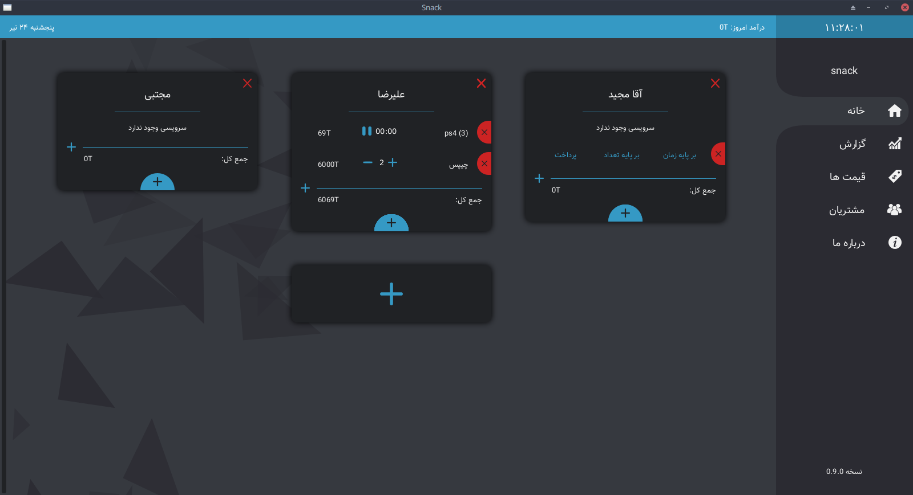
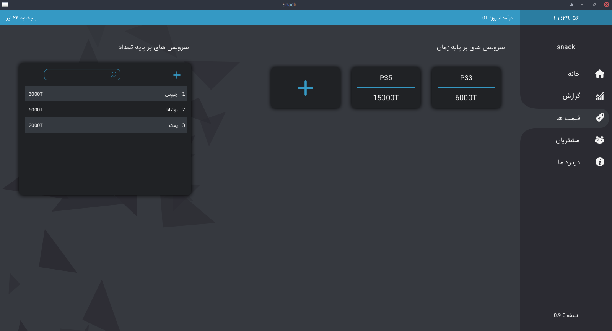
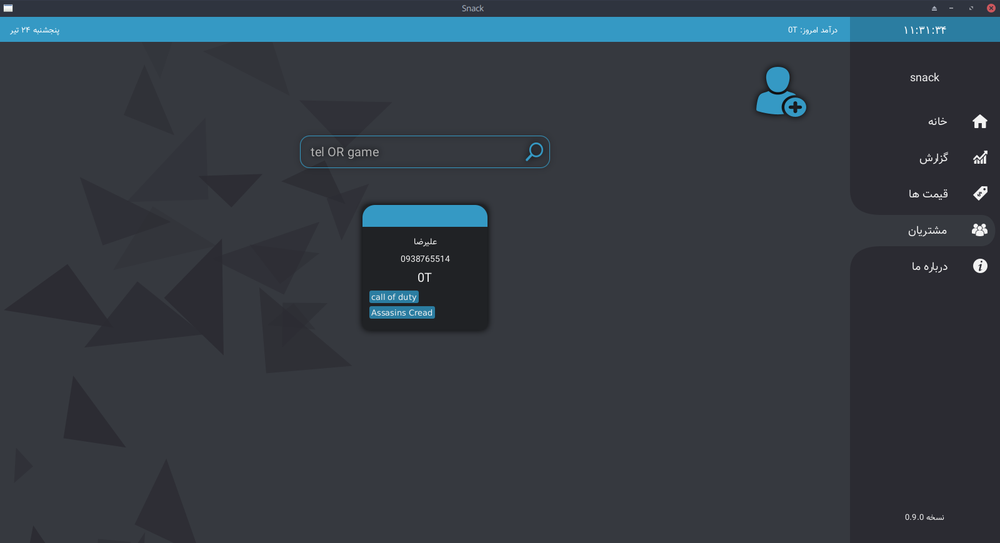
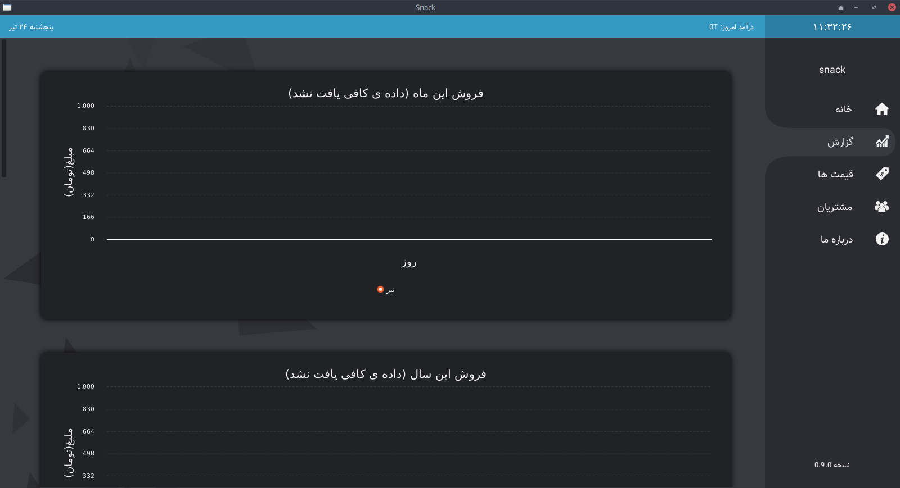

# Snack App
This is an open source good looking😁 desktop app for managing game clubs

# Screenshots
   
   
   
   

# TODO
 1. bug: bad memory leak on AppRefresh
 2. make installer for Windows and Linux and Mac
 3. make release in github
 4. make a cute website with download link to github release